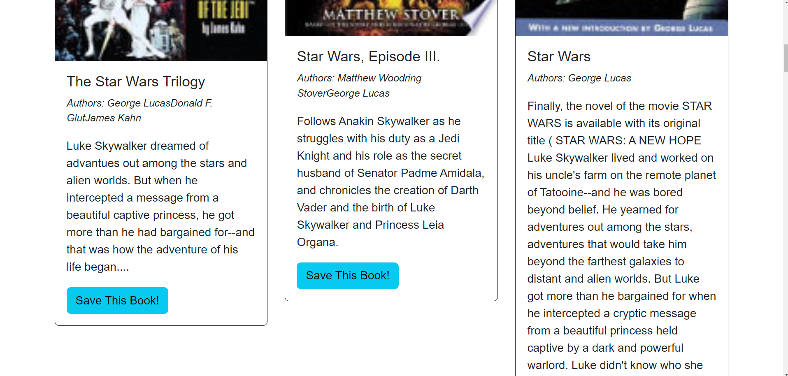

# Book-Seeker

## Description

In this project we were able to harness and understand the power of GraphQL and the Apollo Server by taking a RESTful API and refactor it into something much more dynamic. We repeated our exposure to Auth.js to keep the user authenticated and used it as functional middleware to work with GraphQL. We also implemented Express.js in order to use the Apollo server. We once again worked with typeDefs and resolvers in this application to gain a better understanding of how they are similar to models  and controllers from our previous builds. This project also allowed us to use Query and Mutations again in conjunction with the GraphQL, allowing us to manipulate our data all in one spot/page as opposed to a series of commands over a series of pages or controllers. These queries allowed us to return a user type and the mutations allowed us to do a myriad of things including add users, save books to the user and delete books from the users data. We also used mutation hooks to save books instead of a direct call to the savebook API function. 

## Installation

The first thing you will need to do is go to [GitHub](www.github.com) and clone the repository.

Then you will open the code editor of your choice and install the npm packages with the command `npm i`. After that, you will start an integrated terminal in the server and run the following commands: `npm install` install the rest of the packages. Then you will enter the command `npm start` to start your GraphQL running on the localhost port. You can test the APIs, queries and mutations here. You will then move over to the client side and run the code `npm run build` and then `npm run develop` to launch the webpage.

## Usage

When the webpage loads, you are presented with this screen:

From here you can Search for Books using the search bar and button, or login/Sign Up in the top right corner.

When using the search bar, you can return a series of books based on the API calls. In our examples, we asked for all the Star Wars books and Wheel of Time Books that were available in the database.

After signing up or logging in, you could save those books to your personalized webpage.

And your homepage would display the books you saved!

## Credits

Many thanks and all credit go to the teaching staff at the UCLA Bootcamp for helping myself and my classmates learn all the coding up to this point and allowing us to make practical use of what is being taught. This was a very hands on class and the ability to learn and understand all the coding that went into this full stack development is quite daunting, but completely achievable with the help of the knowledgeable instructors!
